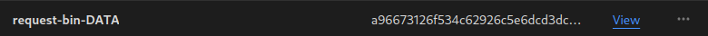
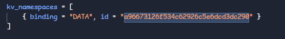

# Request Bin

A simple cloudflare worker based request bin. You can use my hosted version at https://bin.willow.sh/ or [self host](#self-host)!

## Endpoints

### ANY `/:id`

You can send any non-GET request to this endpoint and it'll be saved for you. E.g. a webhook via a POST request.

If you send a GET request it'll return all the saved requests. The data includes the JSON body, headers, and a timestamp.

### GET `/new`

This endpoint will create a new id and redirect you to it. It's not required as all uuids (v4) are automatically valid request bins. 

## Self Host

1. Setup this repository locally

We'll need to get the request bin running locally, which requires [NodeJS](<https://nodejs.org/en>) 18+ and [pnpm](https://pnpm.io/). Open it in your favourite editor and run `pnpm install`.

2. Create KV Namespace

We use [Cloudflare KV](https://developers.cloudflare.com/kv/) to store the request bin data, so we need to create your namespace. You can do that on the [Cloudflare Dashboard](https://dash.cloudflare.com/?to=/:account/workers/kv/namespaces). You can name it whatever you like here, I went with `request-bin-DATA`.

Find the `wrangler.toml` file in the repo and replace the current namespace id with your new one.

You'll also need to edit the `account_id` field in the same `wrangler.toml`, if you don't know this it'll be in the URL on the Cloudflare dashboard.

3. Deploy

Running `pnpm run deploy` will build and deploy the worker to Cloudflare. Once it's published you can visit the generated URL and you have your very own request bin!
